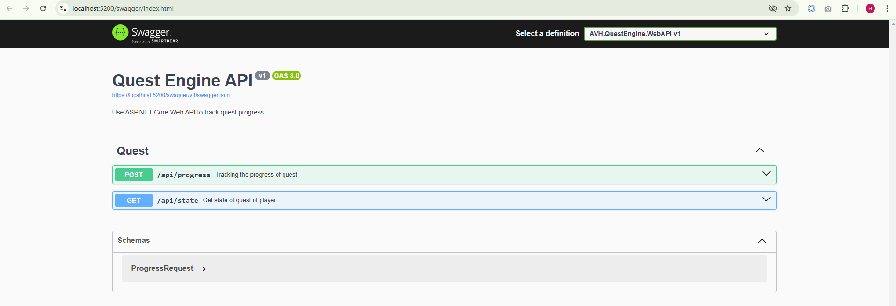
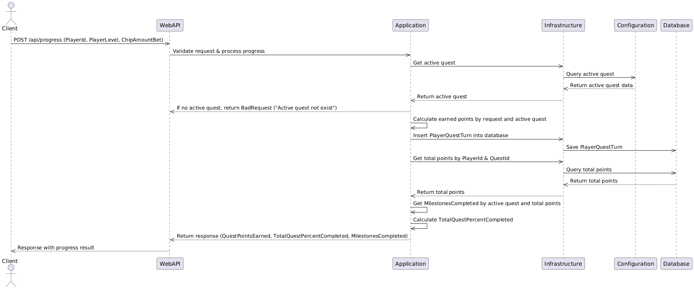

# Run Project

**Use Visual Studio**

Open file solution *AVH.QuestEngine.sln* and press F5

**Use command line**

Open folder *AVH.QuestEngine* and run command
`dotnet run`

When starting project, the migration runs automatically to create SQLite database (if not existing) and seed default data.

# Sequence Diagram

# Quest Configuration
The file configuration located in [here](src/AVH.QuestEngine.WebAPI/QuestConfig.json)

### Quest-Level Properties
- **`Id`** *(string)* - A unique identifier for the Quest.
- **`Code`** *(string)* - A short code representing the quest.
- **`Name`** *(string)* - The full name of the quest.
- **`TotalQuestPointsRequired`** *(int)* - The total number of points required to complete the quest.
- **`RateFromBet`** *(double)* - The multiplier applied to a player's bet amount to calculate quest points.
- **`LevelBonusRate`** *(double)* - The multiplier applied to a player's level to calculate quest points.
- **`IsActive`** *(boolean)* - Indicates whether the quest is currently active.

### Milestone Properties
Each quest consists of multiple **milestones**, which define progress checkpoints.

- **`Index`** *(int)* - The sequential order of the milestone.
- **`RequiredPoints`** *(int)* - The number of quest points required to reach this milestone.
- **`ChipsAwarded`** *(int)* - The number of chips a player earns upon reaching this milestone.

# Player Quest Schema
The player quest progress is saved to table *PlayerQuestTurn*

### Properties

- **`PlayerId`** *(Guid)*  - A unique identifier for the player participating in the quest.
- **`QuestId`** *(Guid)* - A unique identifier for the quest in which the player is participating.
- **`PlayerLevel`** *(int)* - The player’s current level which will be passed into your API
- **`ChipAmountBet`** *(int)* - The amount of chips the player bet during this turn.
- **`EarnedPoints`** *(double)* - The number of quest points earned by the player in this turn, calculated based on the bet and level.
- **`CreatedDate`** *(DateTime)* - The timestamp indicating when this turn was recorded
